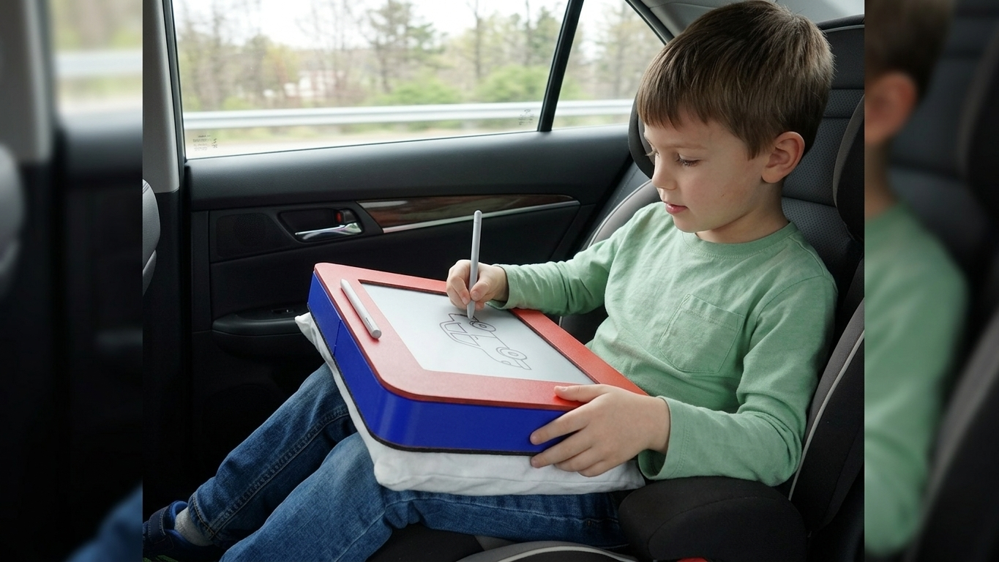
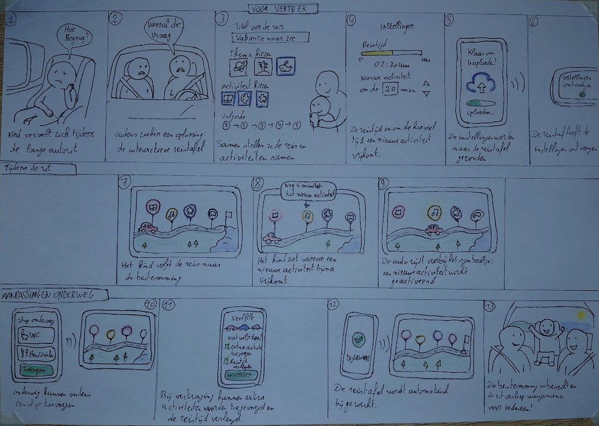

## Interactieve reistafel
Een reistafel om lange autoritten minder stressvol te maken.

🛠️ Built by ``Leen Geenens`` & ``Nils Lammertijn``   
🔥 Supervised by ``prof. dr. Bas Baccarne``, ``Yannick Christiaens`` & ``Wouter Devriese``    
🌱 Grown at ``Ghent University`` 🏛️ ``Industrial Design Engineering`` ([project overview](https://github.com/basbaccarne/human-centered-design))       

*13/06/2026 van de laatste update*   

## Samenvatting
Bij lange autoritten kunnen jonge kinderen zich vaak vervelen. Hierbij komt vaak de vraag: 'Hoe lang is het nog?'. Dit kan bij veel ouders stress opleveren. Hier willen we een oplossing voor vinden.

Door middel van interview, een literatuurstudie en een benchmark onderzoek in de discovery fase is gebleken dat er al veel verschillende oplossingen bestaan, maar dat kinderen die snel beu geraken en zich dan beginnen te vervelen. Uit deze fase werd gehaald dat de oplossing best een soort van tafeltje is. 

In de definition fase zijn er in twee verschillende wave met prototypes naar de gebruiker gegaan. Op de implicatie die hieruit zijn gekomen is er verder kunnen gebouwd worden. Één van de zaken die uit deze fase kwam is dat kinderen de weg moeten kunnen volgen, en hierdoor ook weten wanneer dat ze gaan stoppen. 

In de eerste development fase werd er verder gegaan met het concept waarbij de oppervlakte van de tafel een E-ink scherm is.  Hieruit bleek dat het scherm dat op dat moment werkt gebruikt functie had dat overbodig waren. Om te zorgen dat de kinderen hun niet beginnen te vervelen moeten er voldoende activiteiten beschikbaar zijn, in deze fase werd dan ook een lijst opgesteld met allemaal verschillende activiteiten. 

In de volgende fase van de development werd er vooral aandacht besteed aan hoe groot de tafel mag zijn. Dit gebeurden aan de hand van een antropometrische analyse. Waarbij zowel via de DINBelg tabel als met afmetingen van de testpersonen werd gewerkt. 

In de laatste fase van de development werd er aandacht besteed aan de materiaalkeuze voor de reistafel en hoe dat de interface van de reistafel er moet uitzien. In deze fase is er ook besloten dat de tafel uit maar één scherm gaat bestaan die alle functie heeft en niet langer met verschillende schermen werkt per functie. 

Deze oplossing biedt de kinderen veel activiteiten waardoor ze hun minder snel gaan vervelen tijdens lange autoritten. Hierdoor gaan ze minder vragen stellen en ervaren de ouders minder stress tijdens de autoritten. 

storyboard

## Introductie
Ouders ervaren stress bij het opvoeden van hun jonge kinderen. Met het project proberen we een aspect waardoor ze stress ervaren te kunnen verminder of zelf weg te nemen. Via de tip de werden gevonden op Kind&Gezin [^1] ontstond het idee om een oplossing te ontwikkelen rond autoritten met kinderen.

Tijdens lange autoritten stellen kinderen vaak vragen zoals “Hoe ver is het nog?” of “Wanneer zijn we er?”. Wanneer deze vragen voortdurend worden herhaald, kan dit voor ouders na verloop van tijd vervelend worden of extra stress veroorzaken. Daarnaast komt het vaak voor dat kinderen beginnen te klagen dat ze zich vervelen en niet weten wat ze kunnen doen tijdens de rit.

Het doel van dit project is om ervoor te zorgen dat ouders minder stress ervaren tijdens lange autoritten. Dit willen we bereiken met behulp van een product: de interactieve reistafel. Met deze tool kunnen kinderen zien hoelang de reis nog duurt. Daarnaast biedt het product verschillende activiteiten waarmee de kinderen hun kunnen bezighouden tijdens de autorit. Ze weten wat ze kunnen doen, waardoor ze hun ouders minder storen en minder klagen. Op die manier kunnen ouders meer ontspannen en genieten van de rit.  

## Inhoudstafel

1. [Methodologie](./docs/methodologie.md)
2. [Discovery](./docs/discovery.md)
3. [Defintion](./docs/definition.md)
4. [Development_1](./docs/development_1.md)
5. [Development_2](./docs/development_2.md)
6. [Development_3](./docs/development_3.md)
7. [Design Requirements](./docs/design_requirements.md)
8. [Bill of materials](./docs/bom.md)

## Kritische reflectie
In dit project zijn er aspecten die goed lopen en anderen lopen minder goed. 

Discovery
In de eerste fase, de discovery, is er op verschillende mogelijkheden onderzocht of probleem wel degelijk een probleem was. Zo is er eerst een literatuuronderzoek geweest, gevolgd door een benchmark onderzoek. Met de bevindingen die uit deze onderzoeken zijn gewonnen, zijn er interviews gedaan met ouders van jonge kinderen. Om zo na te gaan of de bevindingen die tijdens de eerder bekomen onderzoeken wel klopten met de ondervindingen van de ouders zelf. 

Definition
In de definition fase werd er zowel in wave 1 als in wave 2 gefocust op hoe de reistafel er moet uitzien. Dit was achteraf niet de beste optie, want het doel van de slimme reistafel is om kinderen bezig te houden tijdens lange autoritten. Om hiervoor te zorgen is het belangrijk dat er een duidelijk interface is dat kinderen gemakkelijk kunnen gebruiken. Daarom was het beter geweest dat één van beide waves hierover was gegaan. 

Development 1 
In de volgende fase is hier wel op gefocust om de interface kindvriendelijk te maken. Hierbij werd ook een onderzoek gedaan naar welke spelletjes de kinderen allemaal zouden kunnen doen op de slimme reistafel. Dit werd gedaan op basis van de benchmark van in de vorige fase en door dit tijdens de test aan ouders te vragen. 
Na de gebruikers testen werden duidelijk dat een aantal functie die het scherm nu had niet noodzakelijk zijn en ander moeten aangepast worden. 
Op het einde van deze fase is er nog een benchmark onderzoek gedaan om de lijst met verschillende activiteiten aan te vullen

Development 2 
In deze fase werd er gefocust op antropometrische analyse, hierbij werden de maten genomen uit de DINBelg deze dateert van 2005 dus er kunnen verschillen zitten in afmetingen van de kinderen nu. Ook werden de verschillend maten die nodig waren bij de kinderen opgemeten, hierbij kunnen meetfouten zijn gemaakt. 
Bij het analyseren en beslissen tussen welke intervallen de afmetingen moeten zitten is er afgerond naar mooiere getalen en werden de extreme gevallen weggelaten. Hierdoor wordt er een deel van de doelgroep uitgesloten. 

Development 3
In deze fase werd er gekeken naar het materiaal gebruik voor de reistafel en hoe dat de interface er moet uitzien. 
Hiervoor werden verschillend materialen op het prototype gezet met behulp van AI. Met afbeeldingen hiervan werd er naar de gebruiker gegaan. Dit had het nadeel dat kinderen het niet konden voelen. Voor de onderkant van de tafel werden wel fysieke soorten moes en kussen meegenomen. 
De interfaces die werden meegenomen waren enkel statisch de kinderen konden et niet op tikken. 
Om de kinderen te laten beslissen welke interfaces, welk materiaal en uit wat de onderkant moet bestaan, krijgen ze 10 muntjes per fase die ze konden verdelen over de verschillend keuzes die ze op dat moment hadden. Omdat er werd gewerkt met jonge kinderen was de rede achter hun keuze moeilijk te achterhalen en werd er beroep gedaan op wat dat de ouders dachten, zij kennen hun kinderen het best. 

Algemeen 
Er werd getest met jonge kinderen waardoor de gevonden resultaten altijd goed moesten worden gereflecteerd omdat kinderen niet altijd goed kunnen zeggen wat ze slecht en goed vinden. 
Ook was het niet altijd even makkelijk om momenten te vinden om interviews en gebruikerstesten te kunnen uitvoeren. Of om andere responderen te vinden om de gebruikerstesten of interview mee te kunnen doen omdat ze binnen de doelgroep van ouders met kinderen tussen de 3 en 6 jaar. 

## Noot inzake het gebruik van AI
AI werd gebruikt bij het genereren van activiteiten die kunnen gedaan worden tijdens de verschillende benchmarkonderzoeken. Ook werd er aan Chat-GPt gevraagd op ideeën te genereren, deze werden enkel gebruikt als inspiratie. 

Vizcom werd gebruikt om verschillende heroshots te maken van de concepten die bedacht waren. Om de verschillende materialen op de twee concepten te plaatsen in development 3 werd er ook vizcom gebruikt. In die fase werd AI ook gebruikt om verschillende interfaces te maken. 

Het werkende interfaces werd via figma make gegenereerd. 
Het storyboard werd met behelp van AI gemaakt. De verschillende stappen werden ingevoerd en gevraagd om er tekeningen bij te maken. 

Er werd ook AI ingezet om de geschreven protocollen en analyses qua vormgeving en taalkundig beter te maken.

## Bijlagen
### Discovery
* Literatuuronderzoek (N=6)
  * [Protocol](https://ugentbe-my.sharepoint.com/:b:/g/personal/leen_geenens_ugent_be/IQBsOY9S5oS9QrdSrLsqgqQ1AdpNBm8m1VRr9Bd9f2GTZlk?e=UyS35o)
  * [Rapport](https://ugentbe-my.sharepoint.com/:b:/g/personal/leen_geenens_ugent_be/IQDzkuJf3-01TJQb0HLvGG-nAStBQKSF2qp8T9AY2jjgKZQ?e=KJAXkb)
* Interviews (N=3)
  * [Protocol](https://ugentbe-my.sharepoint.com/:b:/g/personal/leen_geenens_ugent_be/IQA9ukIdhH74QJSWliXNOJOzAZD9KHz2d_6u_1s58r3-KMQ?e=ukrQJk)
  * [Data](https://ugentbe-my.sharepoint.com/:b:/g/personal/leen_geenens_ugent_be/IQCBhfi5NewwTY0-fNIIkftkAT1-CLzJRgIDdvMt3trKV0U?e=TcIXGe)
  * [Rapport](https://ugentbe-my.sharepoint.com/:b:/g/personal/leen_geenens_ugent_be/IQAEqDxpMk0bS7Dps-ySLsnuAeIYavCiZ_VNKWM42BDdsVo?e=MuEvbP)
* Benchmarking (N=10)
  * [protocol](https://ugentbe-my.sharepoint.com/:b:/g/personal/leen_geenens_ugent_be/IQDBd6ShQOb5T73CXyujJ3-kAdzyOcG1jP8X4UJGCiZRhak?e=UGgj3j)
  * [Rapport](https://ugentbe-my.sharepoint.com/:b:/g/personal/leen_geenens_ugent_be/IQBykY66T8ktQ7JY6XUodjbwAbXW58qWUzjFe37AUNvj0t0?e=803W75)
    
### Definition
* User testing wave 1 (N=4)
  * [Protocol](https://ugentbe-my.sharepoint.com/:b:/g/personal/leen_geenens_ugent_be/IQA0s36TH-BcRqcUoV6L5BbmAVYPRV7PpvblXWWcrTy6Vyo?e=tjwE5S)
  * [Rapport](https://ugentbe-my.sharepoint.com/:b:/g/personal/leen_geenens_ugent_be/IQDGqbV3u6EXTKZ31fz4pSUXASw-eatrck0N1P3p4iy9lr0?e=naaeLq)
* User testing wave 2 (N=4)
  * [Protocol](https://ugentbe-my.sharepoint.com/:b:/g/personal/leen_geenens_ugent_be/IQBwOTY-YPs5RocPrKWpzmyOAT_3n6RWwHoO8IfFhkctzaU?e=EPU3H7)
  * [Rapport](https://ugentbe-my.sharepoint.com/:b:/g/personal/leen_geenens_ugent_be/IQDjlcKoNx9nRI_dEEi9EP3AAbrubO676Pz-PecjZFWP6io?e=3kfdao)

 ### Development 1
 * user testing (N=3)
   * [Protocol](https://ugentbe-my.sharepoint.com/:b:/g/personal/leen_geenens_ugent_be/IQBCnCu6lsSJSbS7qKnXV_jAAcjgXQTpkaig9gDiJ5SgncA?e=qPQs5i)
   * [Rapport](https://ugentbe-my.sharepoint.com/:b:/g/personal/leen_geenens_ugent_be/IQBiPFn3fhlFQZjNhxuTCzYtAYFK-aE4ni8T4ltk_Ey35xk?e=mPe08Q)
 * benchmark onderzoek (N=7)  
   * [Protocol](https://ugentbe-my.sharepoint.com/:b:/g/personal/leen_geenens_ugent_be/IQC2s0uATP20SIWTSXYJkkfQAcauSKc3awHIw-vJhxW0fWU?e=Nrd0Ic)
   * [Rapport](https://ugentbe-my.sharepoint.com/:b:/g/personal/leen_geenens_ugent_be/IQAQOjf7KNq0QptzuPCe4pUQAfXGzriW5OZ8wT3CeBtPVn4?e=lXLpL2)

### Development 2
* user testing (N=3)
  * [Protocel](https://ugentbe-my.sharepoint.com/:b:/g/personal/leen_geenens_ugent_be/IQDUOeMw54VtQppBvbNR2KBoAfUh34X_jwG1SVIq3OIuXU0?e=oJCBRX)
  * [Rapport](https://ugentbe-my.sharepoint.com/:b:/g/personal/leen_geenens_ugent_be/IQBmpgBU7w52Qob940C-XvyIAQkTjLqLay4jtR5HIUptejY?e=7LjPHJ)

### Development 3
* Benchmarking (N=25)
  * [Protocol](https://ugentbe-my.sharepoint.com/:b:/g/personal/leen_geenens_ugent_be/IQAgOXl4BKsST4TTx-lkhGCuAR8QBzfbV6wIKOcLK6Hyqlw?e=94fxT4)
  * [Rapport](https://ugentbe-my.sharepoint.com/:b:/g/personal/leen_geenens_ugent_be/IQCn0NCOSy-FRY_s_01SUZUoAYyWM-Ukq_UtEgcAYgyZkZw?e=ARREih)
* Vizcom 
  * [Protocol](https://ugentbe-my.sharepoint.com/:b:/g/personal/leen_geenens_ugent_be/IQClaNHlPnNfRb8-E1A3zRcEAbOe5JkYHGbXo6QsSlmQQS4?e=9DgPFt)
  * [Data](https://ugentbe-my.sharepoint.com/:b:/g/personal/leen_geenens_ugent_be/IQCXcG6AaL96Qri21RBXC1eEAaJnOyWiBkO0aM1lSeifjeA?e=XUymAJ)
  * [Rapport](https://ugentbe-my.sharepoint.com/:b:/g/personal/leen_geenens_ugent_be/IQBJ5BVL9g5HRIaLeKU-P3lqARdZYzXEXV_QADPiaYXmOlU?e=DPlNZU)
* Gebruikerstesten (N=3)
  * [protocol](https://ugentbe-my.sharepoint.com/:b:/g/personal/leen_geenens_ugent_be/IQA5T7osnT4JTLyreP_IvsSWAfxawWgDY_HQ4Hzu6qRL-28?e=rgX5ir)
  * [Rapport](https://ugentbe-my.sharepoint.com/:b:/g/personal/leen_geenens_ugent_be/IQC07V_hKWhUSrUJTMcC-kzQAfWNEOaPMXsrUpt90p2JYbI?e=7gW1OD)

## Licentie 

This repository contains both software and design materials created as part of an industrial design energineering project at Ghent University.

- **Software and code:** [MIT License](./LICENSE-MIT)  
- **Design, documentation, CAD, and media:** [CC BY 4.0 License](./LICENSE)
  
You are free to reuse and build upon this work, both commercially and non-commercially, as long as proper attribution is given to the original authors.

## Bronnen
[^1][^2][^3][^4][^5][^6]

[^1]: Kind en Gezin. (z.j.). Reizen met kinderen [Webpagina]. Geraadpleegd op 9
oktober 2025, van https://www.kindengezin.be/nl/thema/reizen-met-kinderen

[^2]: Blabloom. (z.j.). Stil op de achterbank: 9 tips voor een autovakantie met 
kinderen [Webpagina]. Geraadpleegd op 21 oktober 2025, van 
https://www.blabloom.com/nl/blog/onderweg/stil-op-de-achterbank-9-
tips-voor-een-autovakantie-met-kinderen

[^3]: Mic Mac Minuscule. (2023, 22 juni). Hoe overleef ik een autoreis met 
kleine kinderen? [Webpagina]. Geraadpleegd op 21 oktober 2025, van 
https://www.micmacminuscule.be/l/hoe-overleef-ik-een-autoreis-metkleine-kinderen/

[^4]: BigSellers. (z.j.). Speelgoed voor in de auto: 24 vakantie cadeautjes voor 
onderweg [Webpagina]. Geraadpleegd op 21 oktober 2025, van 
https://bigsellers.nl/gadgets/autovakantie-24-gadgets-om-je-kinderen-tevermaken/

[^5]: Verberkt, I. (2025, 30 juli). Slimme gadgets voor reizen met kleine kinderen
[Webpagina]. Geraadpleegd op 21 oktober 2025, van 
https://www.oudersvannu.nl/producten/slimme-gadgets-reizen-metkleine-kinderen~7f0552a

[^6]: OpenAI. (z.j.). ChatGPT – gesprek/sessie [Webpagina]. Geraadpleegd op 28 
oktober 2025, van https://chatgpt.com/c/68f08c8a-e764-832e-8622-
69daec67a7e
