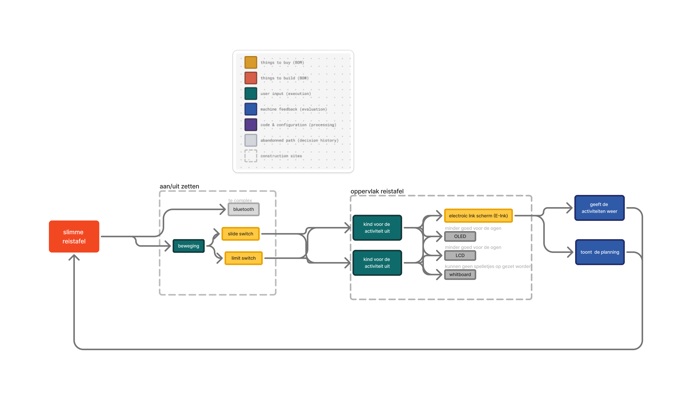

# Bill of materials
Om de laatste versie van het prototype te maken zijn volgende element nodig: 
-	MDF 4 mm de boven-, onder-, achterkant en de stukken waar de reMarkable op rusten worden gelasercut met volgende bestand (.dxf)
    [lasercut](c:\Users\Leen\OneDrive - UGent\Documenten\Leen\ugent\tweede jaar\project GGO\voor-, achter-, zijkant en binnenstukken.dxf)

-	De ander zijkant worden geprint met een 3D-printer PLA met volgende STL-bestand:
    [zijkant](../../3D-model/zijkanten.3mf)
-	Met stof wordt er een kussen gemaakt waar kussen vulling wordt in gedaan (wol)
-	Dit wordt met nietjes en lijm aan de onderkant vastgemaakt
-	Aan het pennetje wordt er een koortje vast geknoopt, het ander uiteinde wordt aan de tafel vast gelijmd. 

Er werd al is nagedacht over de verschillende componenten die er nodig zouden zijn voor een werkend prototype, zie schema hieronder

De interface is gemaakt met [figma make](https://pro-cheer-01182747.figma.site), de versie die hieruit kwam is nog niet optimaal. In verdere stappen zo de code voor de interface worden gemaakt. 
