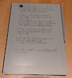

# conclusie
Na de verschillende fases van het ontwerpproces te hebben doorlopen, is het volgend concept eruit gekomen. Via een interactieve reistafel heeft het kind verschillende activiteiten dat ze kunnen doen tijdens de lange autorit en weten ze hoever het nog rijden is. 

## Gebruik
Voordat de ze vertrekken met de auto wordt er via een app op de ouders hun gsm de verschillende functies ingesteld voor de reistafel.  Het instellen van de reistafel kunnen de ouders alleen doen of samen met hun kind. 

Er wordt een titel gegeven aan de reis.

Er wordt een thema gekozen voor de interfaces van de reistafel.

Er worden verschillende activiteiten gekozen die de kinderen willen doen tijdens de rit. Hierbij kan ook de volgorde van de activiteiten bepaald worden. 

Hierna wordt de reistijd ingesteld en om de hoeveel tijd er een extra activiteit bijkomt. 

Als dit allemaal gekozen is kan het worden geüpload naar de reistafel. 

Tijdens het rijden kunnen ouders stops toevoegen om naar de wc te gaan of om iets te eten. Of als er veel file is en de auto gaat niet vooruit kunnen ze extra activiteiten toevoegen en ook de tijd langer maken.

Tijdens de rit zien de kinderen de auto op de baan bewegen richting de bestemming, hierdoor weten ze hoelang ze nog moeten. Elke keer dat de auto een symbooltje van een activiteit voorbijgaat wordt deze geactiveerd en hebben ze dus een extra activiteit. 

De kinderen zien wanneer een nieuwe activiteit gaat geactiveerd worden waardoor ze ernaar kunnen verlangen. 

## Extra uitleg 
Het is de bedoeling dat als het kind een activiteit niet helemaal begrijpt ze extra uitleg kunnen vragen door op het vraagteken te drukken. 

## Materiaalkeuze
Het scherm is een E-ink scherm. Deze soort schermen zijn minder fel en dus minder slecht voor de ogen van de kinderen. Omdat kinderen tegenwoordig al heel veel op schermen zitten is dit een goed alternatief. 

De tafel zou bestaan uit ABS omdat deze voor onderhoud en qua hygiëne het beste te onderhouden is. Er mogen openingen zijn waar kruimels in kunnen vallen. Het moet uit één geheel bestaan. 

Aan de onderkant van de tafel wordt een kussen voorzien zodat het aangenamer is voor de kinderen om de reistafel meerdere uren op hun schout te hebben. 

Het pennetje voor op de tafel moet uit één geheel bestaan en gaat driehoekig zijn. Hierdoor leren de kinderen het pennetje met de juiste handgreep vastpakken. 

## Mogelijkheid om er andere zaken op te doen
Doordat het E-ink scherm verwerkt is in een tafel, is er een mogelijkheid om andere zaken op de tafel te doen, bv, met auto’s erop spelen of hun tablet erop leggen voor een filmpje te kunnen kijken. 

## Opbergmogelijkheid
Aan de tafel zoude velcro zijn, zodat de tafel als die niet gebruikt wordt, aan de stoel voor het kind gehangen kan worden. 

## Conclusie 
De interactieve reistafel zorgt ervoor dat kinderen op een kindvriendelijke manier leuke activiteiten hebben om te doen tijdens lange autoritten en hun hierdoor dus minder snel gaan vervelen. 
