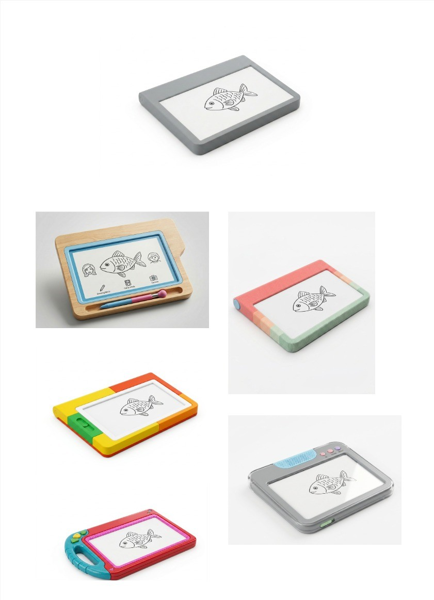
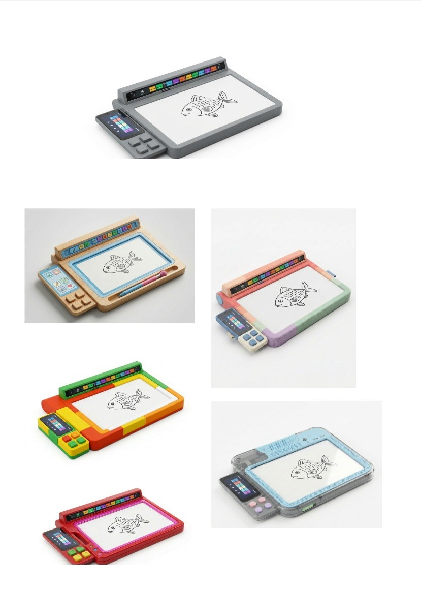
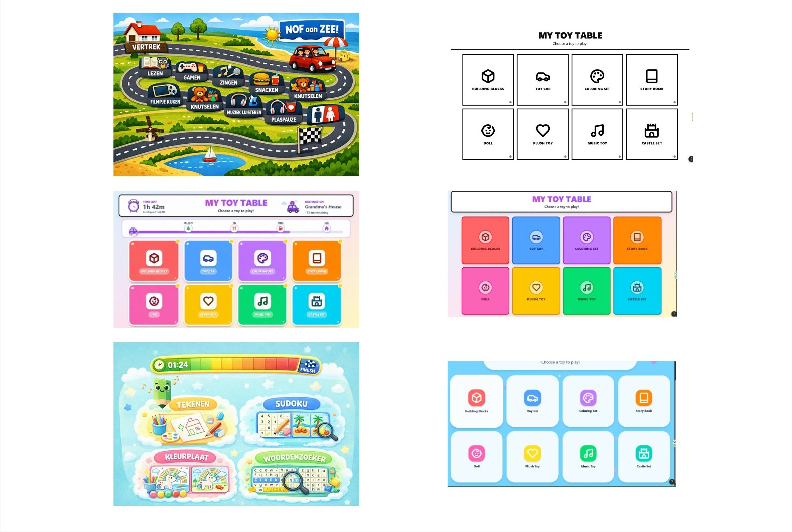

# Development 3
Voordat er aan deze fase werd begonnen is er eerst weer een terugblik geweest op wat er allemaal al gedaan was. Hierbij waren er twijfels over het feit dat er meerdere schermen worden gebruikt. Daarom werd er verder gedaan met twee concepten één met de verschillende schermen en één met maar één scherm. 

## Doelstellingen
Het doel in development 3 is om de interface en de materiaalkeuze voor de reistafel af te stemmen op wat dat de noden van de gebruiker zijn. In deze fase werd er ook nagegaan of de verschillende schermen wel nodig zijn of dat de verschillende functie worden geïntrigeerd in één scherm. 

## Materialen & methoden
Benchmarkonderzoek (N= 25)
Voordat er naar de gebruiker wordt gegaan, is er een benchmark onderzoek gedaan om te kijken uit welke materialen het speelgoed van kinderen bestaat en hoe ze het voor kinderen aantrekkelijk maken. 

Het benchmarkonderzoek werd onderverdeeld in 4 categorieën: 
-	Speelgoed (N= 8) 
Op het verschillend speelgoed werd een CMF-analyse gedaan

-	Onderkant voor de tafel (N=4)
Hierbij werd er gekeken naar wat er nu gebruikt wordt om onder een laptop te steken als er in de zetel wordt gezeten
-	Stiften, kleurpotloden en pennetjes voor op een tablet (N= 8) 
Het pennetje dat nu gebruikt wordt voor op de remarkeble is gemaakt voor volwassen. Er wordt dus gekeken of dit ook hetzelfde is voor kinderen of dat het beter wordt aangepast. 
-	Interface en website (N=4)
Voor het kleurgebruik van de interface voor het scherm werd er recherche gedaan naar bestaande interfaces en websites.  
De onderzoeksvragen en de stappen die werden gevolgd in het benchmark onderzoek zijn terug te vinden in het [protocol](https://ugentbe-my.sharepoint.com/:b:/g/personal/leen_geenens_ugent_be/IQAgOXl4BKsST4TTx-lkhGCuAR8QBzfbV6wIKOcLK6Hyqlw?e=94fxT4).

Met de resultaten uit het benchmark onderzoek werd er verschillende stijlen bekomen van kinderspeelgoed via Vizcom werden met deze stijlen verschillende lay-outs gemaakt van de reistafel om hiermee dan naar de gebruiker te kunnen gaan. 
Hierbij werd er een stappenplan gevolgd en er werden onderzoeksvragen opgesteld. Deze zijn te vinden in het [protocol](https://ugentbe-my.sharepoint.com/:b:/g/personal/leen_geenens_ugent_be/IQClaNHlPnNfRb8-E1A3zRcEAbOe5JkYHGbXo6QsSlmQQS4?e=9DgPFt).

Met de resultaten die uit de voorgaande onderzoeken zijn gehaald werd er naar de gebruiker gegaan. 
Er werden twee concepten meegenomen naar de gebruiker per concept waren er verschillende interface en bij hoorde materialen. 

Concept 1: 

Bij concept 1 is de planning apart van het scherm en is er nog een extra scherm met knoppen voor instructie bij de verschillende activiteiten. 

Concept 2: 

Bij concept 1 wordt alles geïntegreerd naar één scherm. Waarbij er op het scherm de planning is te zien en als de kinderen instructie willen bij een activiteit dat ze die krijgen op het scherm zelf. 

Voor de onderkant werden 4 verschillende soorten moes meegenomen om te kijken wat de kinderen het aangenaamste vinden

Om te weten of het pennetje de juiste dikte heeft, werden verschillende kinderpotloden en -stiften meegenomen.

Voor de onderzoeksvragen en extra uitleg wordt teruggevonden in het [protocol](https://ugentbe-my.sharepoint.com/:b:/g/personal/leen_geenens_ugent_be/IQA5T7osnT4JTLyreP_IvsSWAfxawWgDY_HQ4Hzu6qRL-28?e=rgX5ir)

## Resultaten
Benchmark onderzoek
CMF-analyse kinderspeelgoed 
De kleuren dat voor kinderspeelgoed worden gebruikt vooral de primaire kleuren zijn die voor veel contrast zorgen. Het materiaal dat wordt gebruikt bij de verschillende soorten speelgoed zijn ABS, rubber, EVA-schuim, hout en textiel.  Voor dit concept is textiel niet de beste optie, het kan wel dienen om over de tafel te doen als afwerking. 
Voor de finish van de reistafel wordt er best een matte afwerking gebruikt omdat glanzende objecten de zon meer weerkaatsen. 
Voor de kind vriendelijkheid moeten alle hoeken afgronden worden en mogen er geen kleine losse objecten zijn.  

Onderkant interactieve reistafel
Voor de onderkant van de tafel zou er een zacht materiaal moeten komen zodat het comfortabel aanvoelt aan de kinderen hun benen. 
De meest gebruikte materialen die zorgen dat er een zacht contact, de druk verdeeld wordt en zich aan past aan het been, soft-touch textiel, polyester+ schuim en EVA/polyform schuim zijn. 

Interfaces en website
Bij de recherche van de verschillende interfaces en websites werd er vooral gekeken naar kleur en vorm gebruik. Hieruit kwam dat de achtergrond bestaat uit lichtere kleuren en de fellere kleuren dienen om objecten naar de voorgrond te laten komen. Bijna alle figuren en vormen die worden gebruikt worden met een zwarte lijn afgebakend. 
Alle verschillende zaken dat kinderen kunnen doen worden duidelijk gemaakt met vormen en tekeningen. 
Voor de volledige analyse wordt er verwezen naar het [benchmark report](https://ugentbe-my.sharepoint.com/:b:/g/personal/leen_geenens_ugent_be/IQCn0NCOSy-FRY_s_01SUZUoAYyWM-Ukq_UtEgcAYgyZkZw?e=ARREih)

Vizcom
Met de verschillende stijlen die werden gemaakt uit het benchmark onderzoek werden er verschillende materialen aan de concepten gevoegd: 

Met behulp van AI en de resultaten en conclusie van het onderzoek naar interfaces en websites werden er per concept 3 interfaces gegeneerd

Voor de volledige proces van Vizcom zie [report](https://ugentbe-my.sharepoint.com/:b:/g/personal/leen_geenens_ugent_be/IQBJ5BVL9g5HRIaLeKU-P3lqARdZYzXEXV_QADPiaYXmOlU?e=DPlNZU)

Gebruikers testen 
Uit de testen is gebleken dat de kinderen het niet meer nodig vinden om verschillende aparte schermen te hebben voor de planning en de instructies zolang dat ze alles wel kunnen doen op één scherm. Voor de interface van het scherm is het belangrijk dat het een thema en veel kleuren bevat. Dit vinden kinderen aantrekkelijk. 

Het materiaal waaruit de tafel bestaat moet voor de kinderen kleurrijk zijn en liefst met felle kleuren. De ouders hun voorkeur gaat naar materialen dat goed te onderhouden zijn en af te kuisen. Voor hen staat de hygiëne vanboven. Het materiaal dat het best bij zowel de kinderen als de ouders past is ABS of plastiek. 

Het pennetje moet een dikke punt hebben en de dikte van het pennetje is best niet te dik maar ook niet te dun, zodat kinderen het op een goeie manier kunnen vastnemen. Daarom gaat de voorkeur naar een driehoekig vorm voor het pennetje omdat die ervoor zorgt dat ze het goed vastpakken. De inhammen worden niet toegevoegd omdat het dan toegankelijk blijft voor zowel links- als rechtshandige kinderen. 

Voor de onderkant van de tafel hebben ze allemaal liefst iets zachts. Twee van de drie verkiezen het kussen als beste dan andere het moes met de driehoekjes naar beneden. Het tafeltje met een stof waar kleine bolletjes in zitten vinden ze allemaal minder goed. 

Voor de volledige analyse wordt verwezen naar [report](https://ugentbe-my.sharepoint.com/:b:/g/personal/leen_geenens_ugent_be/IQC07V_hKWhUSrUJTMcC-kzQAfWNEOaPMXsrUpt90p2JYbI?e=7gW1OD)

## Conclusie & implicaties
De tafel bestaat uit één scherm waarop alles kan gedaan worden. De planning is erop zichtbaar en als de kinderen extra uitleg willen bij een activiteit is dat mogelijk. 
Het thema van de interface moet een baan hebben waarop een autootje kan rijden, dit zorgt dat het visueel is voor de kinderen. Op die baan staan verschillende spelletjes die geactiveerd worden als het autootje ze baseert.
Het materiaal voor de tafel is best plastiek of ABS en bestaat uit duidelijk en felle kleuren. Plastiek zorgt dan het voor de ouders gemakkelijk is om het te onderhouden en als er iets op wordt gemorst is het er gemakkelijk af te halen. 
Het pennetje moet dikker zijn dan die voor volwassen en liefst driehoekig zodat de kinderen het op een juiste manier kunnen vastpakken. 
De onderkant van de tafel bestaat uit een kussen zodat het aangenaam op de benen van de kinderen kan rusten. 
 
Met de zaken die uit deze fase werden gehaald is er een prototype gebouwd en een interfase gemaakt. 
Zie [Figma](https://pro-cheer-01182747.figma.site/ ) voor de interface

[Requirement](design_requirements.md)
|ID|Design Requirement|Status|
|:---|:---|:---:|
|**algemeen**|
|1.11|Het materiaal van de tafel moet onderhoudsvriendelijk zijn.||
|1.12|De tafel moet hygiënisch zijn, schoongemaakt kunnen worden.||
|1.13|Het pennetje met een dikke punt hebben.||
|1.14|De onderkant van de tafel moet een kussen bevatten.||
|**functionaliteit**|
|**vormgeving & beleving**|
|3.7|De tafel moet uit 1 scherm bestaa.||
|3.8|De planning van de tafel moet een thema hebben.||
|3.9|De tafel moet felle kleuren hebben.||
|3.10|De tafel moet uit meerdere kleuren bestaan.||
|3.11|Het pennetje moet driehoekige vorm hebben.||